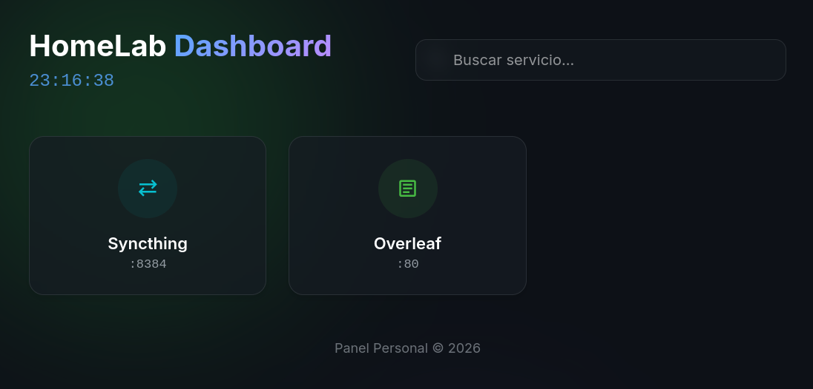

# HomeLab Dashboard

A modern, responsive, and glassmorphism-styled dashboard for your local HomeLab services. Built with pure HTML, CSS, and Vanilla JavaScript.No build steps required.



## 🚀 Getting Started

Simply open `index.html` in your favorite web browser.

No server is required, but you can serve it with any static file server if you prefer (e.g., Nginx, Apache, Python `http.server`).

```bash
# Example with Python
python3 -m http.server 8000
```

## 🛠 Adding New Services

To add a new service, open `index.html` and locate the `<main id="servicesGrid">` section. Copy an existing service block and modify it.

### Example Code Block

```html
<a href="http://localhost:YOUR_PORT" target="_blank" class="card" data-name="keywords for search">
    <div class="card-icon custom-bg">
        <!-- Option 1: Material Icon -->
        <span class="material-symbols-outlined">dns</span>
        
        <!-- Option 2: Custom Image Logo -->
        <!--  -->
    </div>
    <div class="card-info">
        <h3>Service Name</h3>
        <p>:PORT</p>
    </div>
</a>
```

## 🎨 Customizing Icons

### Using Material Symbols
Find an icon name at [Google Fonts - Material Symbols](https://fonts.google.com/icons) and replace the text inside the `span` tag (e.g., `dns`, `movie`, `cloud`).

### Using Custom Images (PNG/SVG)
Replace the `<span class="material-symbols-outlined">...</span>` line with an `` tag:

```html

```

## 🖌 Styling (CSS)

You can customize the colors in `css/style.css` by editing the `:root` variables at the top of the file.

```css
:root {
    --bg-color: #0d1117;
    /* ... */
    --new-service-color: #ff5733; /* Define your color */
}
```

Then create a class for your service background:

```css
.new-service-bg { 
    color: var(--new-service-color); 
    background: rgba(255, 87, 51, 0.1); 
}
```

## 📂 Project Structure

- `index.html`: Main dashboard structure.
- `css/style.css`: All conflicting styles, animations, and responsive design.
- `js/app.js`: Real-time clock and search functionality.

## 📝 License

This project is open source and available under the [MIT License](LICENSE).
